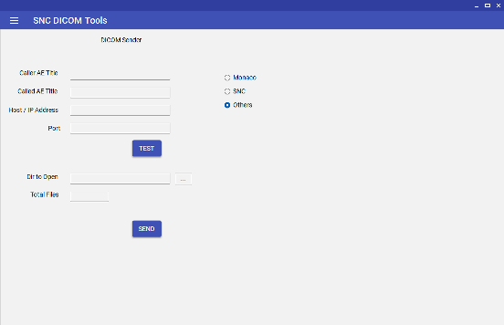
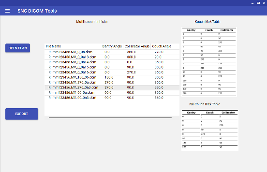
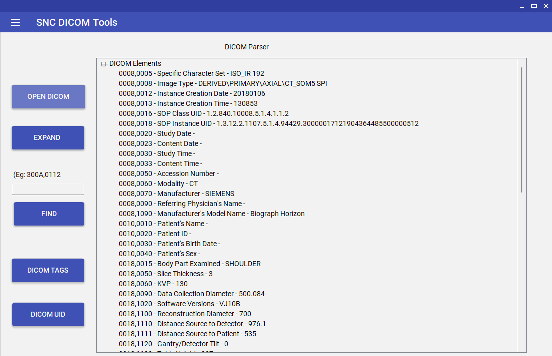
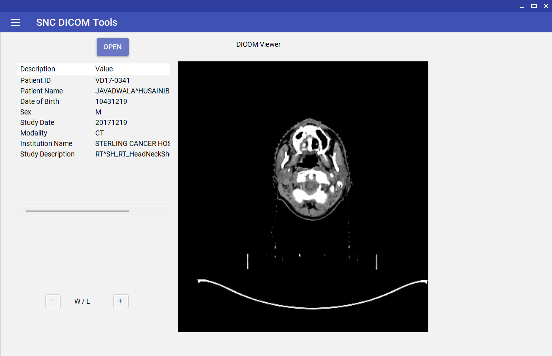
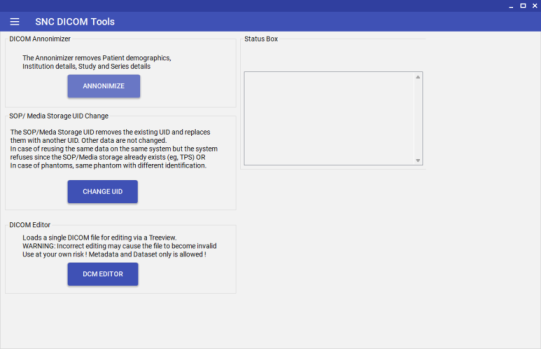

# DICOM-Tools
A collection of DICOM tools for viewing and editing Dicom files and other collections helpful for SNC software

Some of the dicom tools like IsoAnyaliser Image label, Multimet Analyser and Multi Isocenter are written for SNC Software. Others are generic DICOM specific tools.

1. DICOM Push
   

Useful to send a directory of DCM files to a DICOM Storage Server.

2. Multi Isocenter Viewer
   

When a RT Plan has multiple isocenters, this tools can be used to view them and accordingly setup the couch position.
DICOM RT Plan file only can be used.

3. IsoAnalyse Software
   

Some software may require that the Image Label name should be known prior to their usage or configuration. In such situation, this tools might become handy
DICOM RT Images can only be used.

4. Multimet Image Analyser
   

Multimet software uses 2 sets of exposed images based on the couch kick settings, 10 or 19. During the analysis, sometimes the software will give a cryptic warning due to duplicate images or incorrect angels. Using this tool, one can analyse the Collimator, Couch and Gantry angles and compare them to the table. If there is a duplicate or missing file, one can take action accordingly.
DICOM RT Images can only be used.

5. DICOM Parser
   

Generic DICOM file tags lister in a Treeview list. Expand will expand one level more. No editing available, READ only !

6. DICOM Viewer
   

DICOM Image viewer, can be used with any DICOM image modality like CT/MR/etc . Dont load other modalities like Plan/Dose/Struct etc. Use the Mouse wheel to Zoom/Un-zoom and Left mouse key drag for Pan. Click on the + and - buttons to vary the Window/Level values.

7. DICOM Tools

DiCOM Annonimizer   
Chnage UID Changer
DICOM Editor

